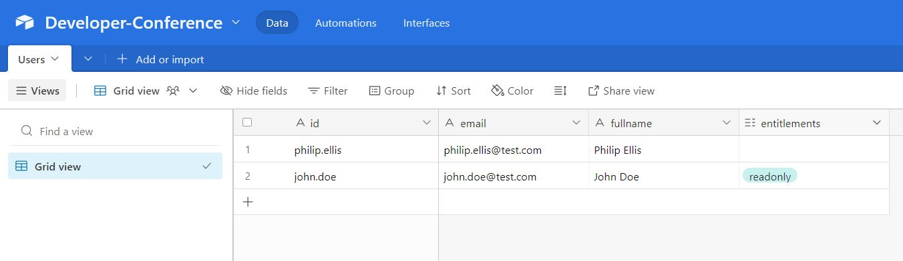

# Airtable sample connector

This connector was built live during the SailPoint Developer Days conference in 2023.

## Setup
To use this connector in your environment, first create a table in [Airtable](https://airtable.com) similar to the one below:



The Airtable base that was used during the conference can be found [here](https://airtable.com/shrgexwEdeZv5flZb)

Next, generate a a config.json in the root of the project that has the following structure:

```json
{
    "apiKey": "Airtable Token",
    "airtableBase": "Airtable Base"
}
```
## Running Locally for Development and Testing
To run the connector locally, first install dependencies:

```bash
npm install
```
and run the connector:

```bash
npm run dev
```
## Deploying to Identity Now
To deploy the connector to Identity Now, run the following:

create a connector in IDN:
```bash
sail conn create developer-days-connector
```

build the connector:
```bash
npm run pack-zip
```

deploy to IDN:
```bash
sail conn upload -c developer-days-connector -f dist/developer-days-connector-0.1.0.zip 
```

## Running the test suite to validate the connector

```bash
sail conn validate -p config.json -c developer-days-connector
```

After running you should get a result similar to the below, showing all tests passing:

```bash
+-----------------------------+--------+--------+----------+---------+
|             ID              | RESULT | ERRORS | WARNINGS | SKIPPED |
+-----------------------------+--------+--------+----------+---------+
| account-create-empty        | PASS   |        |          |         |
| account-create-minimal      | PASS   |        |          |         |
| account-create-maximal      | PASS   |        |          |         |
| account-create-list-delete  | PASS   |        |          |         |
| account-list-and-read       | PASS   |        |          |         |
| account-not-found           | PASS   |        |          |         |
| account-schema-check        | PASS   |        |          |         |
| account-update-single-attrs | PASS   |        |          |         |
| account-update-entitlement  | PASS   |        |          |         |
| entitlement-not-found       | PASS   |        |          |         |
| entitlement-list-read       | PASS   |        |          |         |
| entitlement-schema-check    | PASS   |        |          |         |
| test-connection-empty       | PASS   |        |          |         |
| test-connection-success     | PASS   |        |          |         |
+-----------------------------+--------+--------+----------+---------+
```

